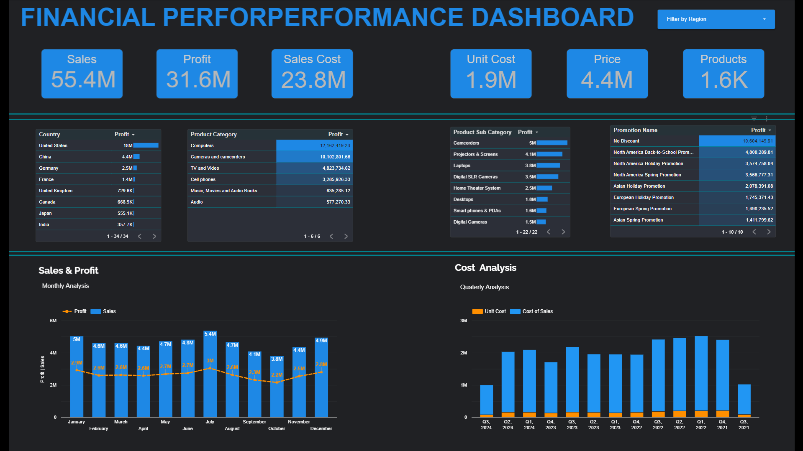

# 📊 Financial Performance Dashboard — Google Looker Studio

> An interactive business intelligence dashboard delivering real-time visibility into sales, profitability, and cost performance across 34 countries and 6 product categories.

---

## 🔍 Overview

This project presents a fully interactive **Financial Performance Dashboard** built in **Google Looker Studio**, powered by a cleaned and transformed Excel dataset. The dashboard enables business stakeholders to monitor core financial KPIs, identify top-performing markets and products, and evaluate the impact of promotional strategies — all from a single, filterable interface.

---

## 🎯 Objectives

- Consolidate multi-dimensional financial data into a single source of truth
- Track and visualise key business KPIs: Sales, Profit, Sales Cost, Unit Cost, Price, and Product volume
- Identify revenue trends, cost drivers, and high-value market segments
- Enable interactive, self-serve reporting for non-technical stakeholders
- Deliver actionable insights to support pricing, marketing, and sales strategy

---

## 🛠️ Tools & Technologies

| Tool | Purpose |
|---|---|
| Microsoft Excel | Data source, cleaning & transformation |
| Google Looker Studio | Dashboard design, data visualisation & interactivity |

---

## ✨ Key Dashboard Features

- **KPI Summary Cards** — instant view of Sales ($55.4M), Profit ($31.6M), Sales Cost ($23.8M), Unit Cost ($1.9M), Price ($4.4M), and 1.6K Products
- **Region Filter** — dynamic, top-level filter to slice all visuals by geographic region
- **Country Profit Table** — ranked profit breakdown across 34 countries
- **Product Category & Sub-Category Tables** — drill-down from category to sub-category level
- **Promotion Performance Table** — profit contribution ranked by promotion type
- **Monthly Sales & Profit Chart** — trend line overlaying bar chart for Jan–Dec analysis
- **Quarterly Cost Analysis** — grouped bar chart comparing Unit Cost vs. Cost of Sales by quarter (Q3 2021 – Q3 2024)

---

## 📈 Key Business Insights

1. **United States** is the highest-profit market at **$18M**, followed by China ($4.4M) and Germany ($2.5M)
2. **Computers** is the top product category driving **$12.2M in profit**, with Cameras & Camcorders second at $10.1M
3. **"No Discount" promotions** generated the highest profit at **$10.6M** — outperforming all promotional campaigns combined
4. **Revenue peaks in July** ($5.4M in sales) and **dips in October** ($4.1M), indicating clear seasonal demand patterns
5. **Cost of Sales consistently exceeds Unit Cost** across all quarters, highlighting scalable margin structure

---

## 🖼️ Dashboard Preview



> *Add your dashboard screenshot here. Export from Looker Studio as PNG and save as `screenshot.png` in the root folder.*

---

## 🚀 How to Use This Project

1. **Clone or download** this repository
2. Open the **Excel dataset** (`Sales.xlsx`) to review the raw and cleaned data
3. Visit the **live dashboard** via the Looker Studio link below *(replace with your published link)*:
   > 🔗 [View Live Dashboard](#)
4. Use the **"Filter by Region"** dropdown at the top right to explore regional performance
5. Hover over charts for tooltips and drill-down detail

---

## 📁 Repository Structure

```
├── Sales.xlsx          # Cleaned Excel dataset
├── screenshot.png      # Dashboard preview image
└── README.md           # Project documentation
```

---

## 🏷️ Tags

`data-analysis` `business-intelligence` `dashboard` `kpi` `data-visualization` `google-looker-studio` `excel` `financial-analytics` `reporting`

---

*Built by [Your Name] · Open to Data Analyst & BI Analyst opportunities globally*
